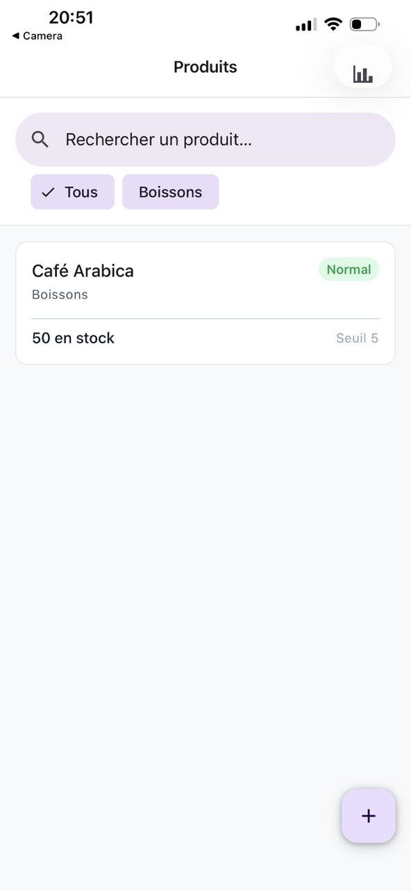
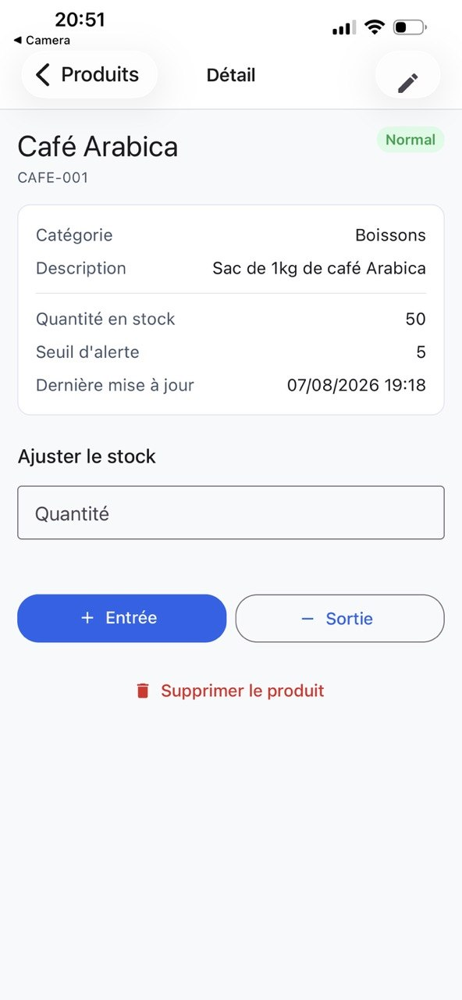
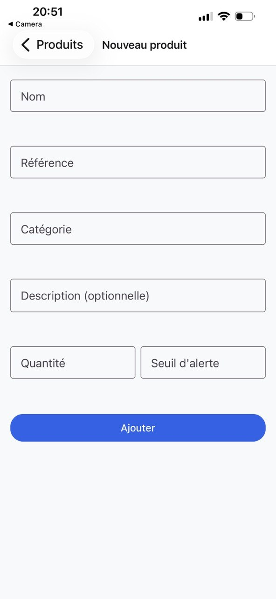
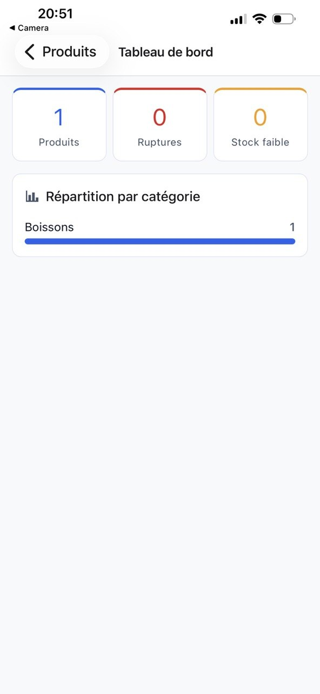
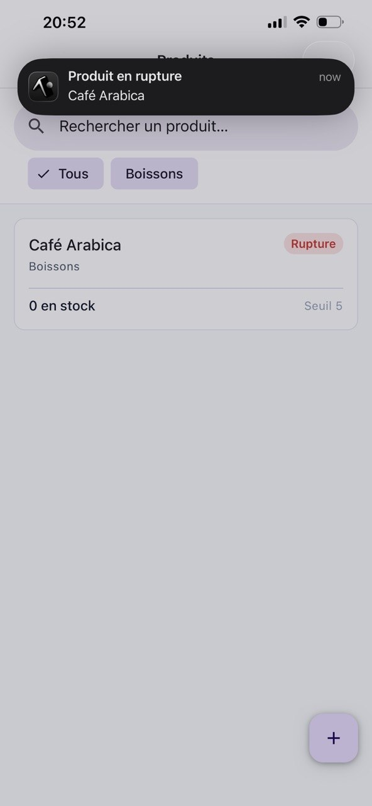

# Gestion de Stock 

Application mobile full stack de **gestion de stock** pour un entrepôt fictif. Elle permet à un gestionnaire de consulter l'état du stock, d'ajouter ou retirer des articles, de créer/modifier des produits et d'être alerté en cas de rupture imminente.

---

## Installation et lancement

### Prérequis

- **Node.js >= 20**
- **npm**
- Application **Expo Go** sur un appareil physique (ou un émulateur Android / simulateur iOS)

### 1. Backend

```bash
cd backend
npm install
cp .env.example .env
npm run start:dev
```

L'API démarre sur `http://localhost:3000`. La base SQLite est créée automatiquement au premier lancement.

### 2. Frontend

Dans un second terminal :

```bash
cd frontend
npm install
cp .env.example .env
npx expo start
```

**Test sur téléphone physique (Expo Go) :** `localhost` ne fonctionne pas depuis un appareil physique. Remplacez `EXPO_PUBLIC_API_URL` dans `frontend/.env` par l'adresse IP locale de votre machine sur le réseau Wi-Fi, par exemple :
> ```dotenv
> EXPO_PUBLIC_API_URL=http://192.168.x.x:3000
> ```
> Le téléphone et l'ordinateur doivent être connectés au **même réseau Wi-Fi**. Pour trouver votre IP locale : `ipconfig` (Windows) ou `ifconfig` / `ip a` (Mac/Linux).

Puis scanner le QR code avec **Expo Go** ou appuyer sur `a` (Android) / `i` (iOS).

> Le backend doit être démarré en premier. Sur émulateur Android, l'application bascule automatiquement l'hôte vers `10.0.2.2`.

---

## Captures d'écran / vidéo

>Les captures d'écran et la vidéo de démonstration.

<p align="center">
  <em>Liste des produits</em><br>
  
</p>

<p align="center">
  <em>Détail d'un produit & ajustement de stock</em><br>
  
</p>

<p align="center">
  <em>Création / modification d'un produit</em><br>
  
</p>

<p align="center">
  <em>Tableau de bord</em><br>
  
</p>

<p align="center">
  <em>Notification de rupture</em><br>
  
</p>

<p align="center">
  <em>Vidéo de démonstration</em><br>
  <a href="./docs/demo.mp4">▶ Voir la vidéo</a>
</p>

---

## Versions utilisées

### Frontend

| Paquet             | Version              |
| ---                | ---                  |
| Expo               | ~54.0.35             |
| React Native       | 0.81.5               |
| React              | 19.1.0               |
| TypeScript         | ~5.9.2 (mode strict) |
| React Navigation   | ^7.3.15              |
| React Native Paper | ^5.15.3              |
| Zustand            | ^5.0.14              |
| React Hook Form    | ^7.84.0              |
| Zod                | ^4.4.3               |
| Axios              | ^1.19.0              |
| expo-notifications | ~0.32.17             |

### Backend

| Paquet          | Version |
| ---             | ---     |
| NestJS          | ^11.0.1 |
| TypeORM         | ^0.3.31 |
| SQLite3         | ^6.0.1  |
| TypeScript      | ^5.7.3  |
| class-validator | ^0.15.1 |
| Swagger         | ^11.4.6 |

---

## Choix techniques

### Pourquoi Expo plutôt que React Native CLI ?

Expo offre un démarrage instantané (`npx expo start`), un tooling unifié et un rechargement over-the-air. Pour un exercice technique dont le rendu doit démarrer sans configuration supplémentaire, c'est le choix le plus efficace. La New Architecture React Native est activée (`newArchEnabled: true`) pour bénéficier des dernières performances.

### Pourquoi Zustand plutôt que Redux Toolkit ?

Zustand apporte une API minimaliste, sans boilerplate (pas d'actions/créateurs/reducers à écrire), une intégration native avec React via des hooks, et des re-rendus optimisés grâce aux sélecteurs fins. C'est parfaitement adapté à la portée de cet exercice tout en restant scalable.

### Pourquoi React Native Paper ?

Material Design 3 fournit des composants accessibles et cohérents (boutons, champs, chips, FAB, Snackbar) prêts à l'emploi, ce qui accélère le développement d'une interface soignée sans réinventer la roue.

### Pourquoi React Hook Form + Zod ?

React Hook Form gère efficacement les formulaires avec un minimum de re-rendus, et Zod fournit un schéma de validation typé réutilisable côté frontend (les erreurs sont affichées champ par champ).

### Pourquoi NestJS pour le backend ?

Le sujet laisse le backend au choix. NestJS fournit une architecture modulaire propre (modules/controllers/services/DTOs), une validation des entrées via `class-validator`, une documentation Swagger auto-générée, et une gestion d'erreurs standardisée. Le tout en TypeScript, cohérent avec le frontend. SQLite a été choisi pour la persistance afin d'éviter toute configuration de base de données externe.

### Gestion d'erreur

Le frontend classifie les erreurs en 4 types (`reseau`, `serveur`, `client`, `inconnu`) via une classe `ApiError`, avec des messages en français et une UI différenciée quand le backend est indisponible (guidage explicite vers `localhost:3000`).
